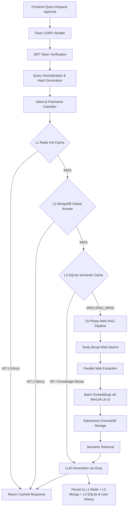

# SourceIQ — Web-Grounded RAG Backend API Service

Production-grade, modular Retrieval-Augmented Generation (RAG) backend API service designed to produce source-backed engineering educational content. The system integrates Tavily Search API, Docling/Trafilatura layout scrapers, ephemeral ChromaDB vector stores, SentenceTransformers, Groq LLM API, MongoDB Atlas, SQLite, and Redis.

> **Architecture Note**: This repository contains the **pure Flask REST API backend service**. The standalone React frontend application lives in a separate repository (`frontend`).

---

## 🏗️ Architecture & Multi-Tier Request Routing



---

## 💾 Cache Tier & Database Responsibilities

| Tier / Database | Designation | Primary Responsibilities |
| :--- | :--- | :--- |
| **Redis** | **L1 Hot Cache** | Microsecond exact query answer lookup (`rag:exact:<hash>`), query embeddings (`rag:qembed:<hash>`). |
| **MongoDB** | **L2 Database** | User registration (`bcrypt` hashed passwords), JWT user history, and reusable global answer metadata (`reusable_answers`). |
| **SQLite** | **L3 Semantic Cache** | Vector similarity cache storing web pages, text chunks, and embedding BLOBs for `KNOWLEDGE_REUSE`. |
| **ChromaDB** | **Ephemeral Store** | In-memory retrieval index created and garbage-collected per RAG query execution. |

---

## 📡 REST API Endpoint Reference

| Method | Endpoint | Description | Auth Required |
| :--- | :--- | :--- | :---: |
| `GET` | `/` | API Health check & service status | No |
| `POST` | `/api/auth/register` | Register new user account (returns JWT token & user profile) | No |
| `POST` | `/api/auth/login` | Authenticate existing user (returns JWT token) | No |
| `GET` | `/api/auth/me` | Fetch active authenticated user profile | **Yes** |
| `GET` | `/api/history` | Retrieve user-scoped query history threads | **Yes** |
| `GET` | `/api/history/:id` | Fetch specific query history details and messages | **Yes** |
| `DELETE` | `/api/history/:id` | Delete specific user query history entry | **Yes** |
| `POST` | `/api/upload` | Upload `.pdf`, `.docx`, `.txt`, `.md`, `.csv` document attachment | **Yes** |
| `POST` | `/api/chat` | Execute web-grounded RAG query pipeline | **Yes** |

---

## 📁 Repository Directory Structure

```text
RAG_26/
├── config/
│   ├── config.py                 # Central configuration & database URIs (.env)
│   └── trusted_sources.py        # Domain whitelist of trusted educational sources
├── utils/
│   ├── auth.py                   # Bcrypt password hashing & JWT token handling
│   ├── document_loader.py        # PDF/DOCX/TXT text extraction utility
│   ├── logger.py                 # Structured application logging
│   └── helper.py                 # Timing & stdout formatting helpers
├── cache/
│   ├── cache_manager.py          # Multi-tier coordinator (Redis + Mongo + SQLite)
│   ├── redis_store.py            # L1 In-Memory Redis Store
│   ├── mongo_store.py            # L2 Persistent MongoDB User & History Store
│   ├── sqlite_store.py           # L3 SQLite Persistent Page/Chunk/Vector Store
│   ├── semantic_cache.py         # Cosine similarity decision engine
│   ├── query_normalizer.py       # Query normalization and SHA-256 hashing
│   └── intent_classifier.py      # Intent & freshness classifier
├── phase1..10/                   # Web-Grounded RAG Pipeline Phases 1-10
├── app.py                        # Flask Backend Application & REST API Server
├── .env                          # Local API keys & MongoDB URI configuration
├── .env.example                  # Template configuration file
├── requirements.txt              # Backend package dependencies
└── README.md                     # Backend Documentation
```

---

## 🚀 Setup & Execution Guide

### 1. Environment Setup

Create a virtual environment and install dependencies:
```powershell
python -m venv .venv
.\.venv\Scripts\Activate.ps1
pip install -r requirements.txt
```

### 2. Configure Environment Variables (`.env`)

Copy `.env.example` to `.env` and set your credentials:
```env
TAVILY_API_KEY=tvly-...
GROQ_API_KEY=gsk_...
GROQ_MODEL_NAME=openai/gpt-oss-120b
MONGODB_URI=mongodb+srv://...
```

### 3. Run the Backend API Server

```powershell
python app.py
```
The server will start on `http://127.0.0.1:5001`.

### 4. Interactive CLI Mode

To run the pipeline directly in terminal mode without Flask:
```powershell
python -m phase10.web_grounded_rag
```
